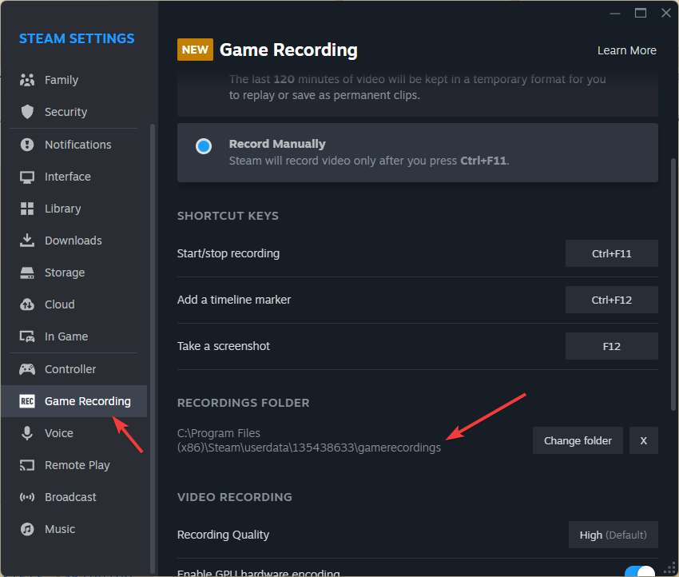
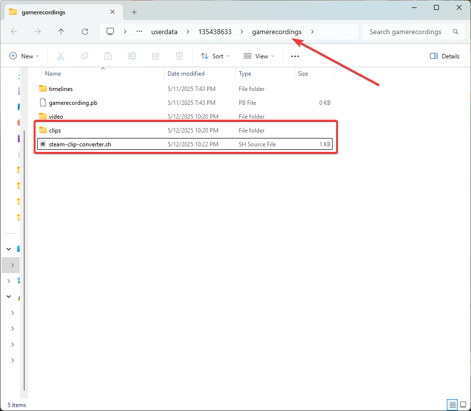

# steam-clip-converter
<p align="center">
    <b>English</b>　<a href="/README_ru-ru.md">Русский</a>
</p>

A simple bash-script that combines recordings made by Steam on PC, Steam Deck, or other devices into a single .mp4 or .mkv file.

> [!TIP]
> 
> This script runs on Linux.

> [!TIP]
> 
> Required ffmpeg([link](https://ffmpeg.org/download.html))

## How to use
1. Move to folder with ```clips``` directory.
> [!TIP]
> 
> ```Steam``` -> ```Settings``` -> ```Game Recording``` -> ```Recordings folder``` on your device(on Steam Deck, it is only visible in Desktop Mode).
> 

> [!TIP]
> 
> You have to be in a folder with ```clips``` folder, not in that folder.
> 

2. Create script ```steam-clip-converter.sh``` and paste the code below or download it [here](./steam-clip-converter.sh).
```bash
#!/bin/bash
mkdir -p ~/Videos

folder=$(pwd)
echo "Working directory: $folder"

for i in $(ls clips); do
  video_path=./clips/$i/video
  subdirs=($(find "$video_path" -mindepth 1 -maxdepth 1 -type d))
  count=${#subdirs[@]}

  idx=1

  for subdir in ${subdirs[*]}; do
    # You may change "output_file=~/Videos/$i.mkv" and "output_file=~/Videos/${i}_$idx.mkv"
    #             to "output_file=~/Videos/$i.mp4" and "output_file=~/Videos/${i}_$idx.mp4".
    if [ $count -eq 1 ]; then
      output_file=~/Videos/$i.mkv
    else
      output_file=~/Videos/${i}_$idx.mkv
    fi

    if [ -f "$output_file" ]; then
      echo "File $output_file already exists. Skipping..."
      idx=$((idx + 1))
      continue
    fi

    echo "Processing clip: $i (segment $idx of $count)"
    cd $subdir
    pwd

    tmp_vid=/tmp/video_${i}_$idx.mp4
    tmp_aud=/tmp/audio_${i}_$idx.mp4

    cat ./init-stream0.m4s ./chunk-stream0-*.m4s > $tmp_vid
    cat ./init-stream1.m4s ./chunk-stream1-*.m4s > $tmp_aud

    ffmpeg -i $tmp_vid -i $tmp_aud -c copy $output_file

    rm $tmp_vid $tmp_aud

    cd $folder
    idx=$((idx + 1))
  done
done

```

3. Make script executable - place command in terminal and press Enter:
```sh
chmod +x steam-clip-converter.sh
```

4. Run script - place command in terminal and press Enter:
```sh
./steam-clip-converter.sh
```

The resulting videos will be saved in the ```Videos``` folder in your home directory.

