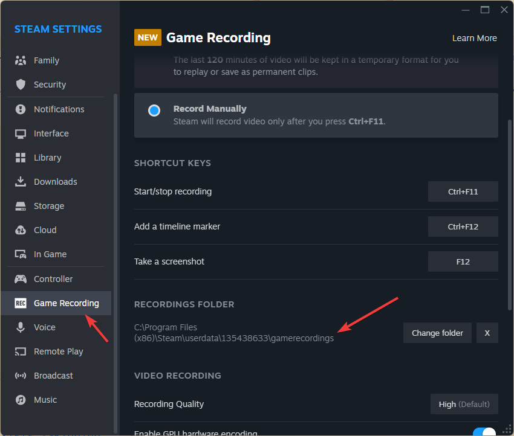
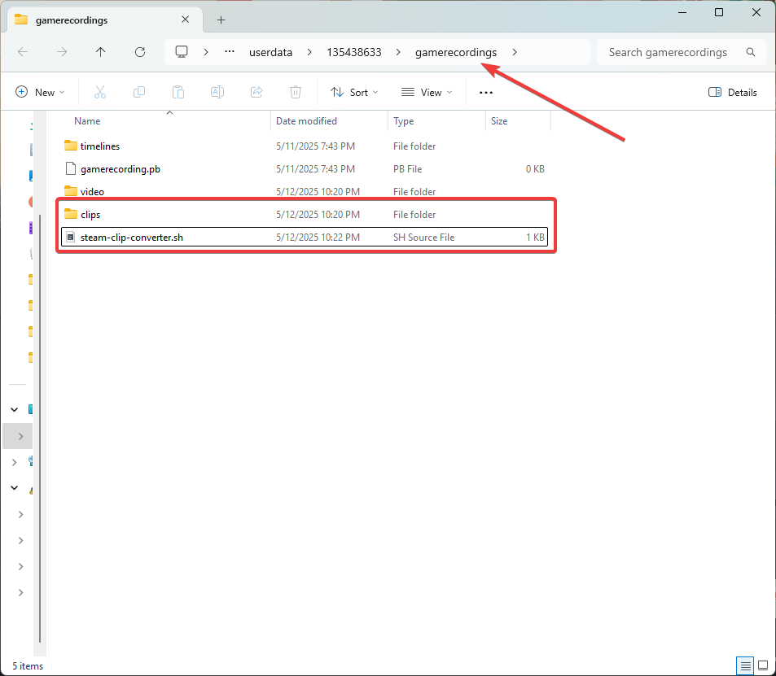

# steam-clip-converter
<p align="center">
    <a href="/README.md">English</a>　<b>Русский</b>
</p>

Простой bash-скрипт, который объединяет видеозаписи, созданные Steam на ПК, Steam Deck или другом устройстве, в один .mp4 или .mkv файл.

> [!TIP]
> 
> Данный скрипт запускается на Linux.

> [!TIP]
> 
> Требуется установленный ffmpeg([link](https://ffmpeg.org/download.html))

## Как использовать
1. Перейдите в папку, содержащую папку ```clips```.
> [!TIP]
> 
> ```Steam``` -> ```Настройки``` -> ```Запись игр``` -> ```Папка для записей``` на вашем устройстве(на Steam Deck показывается только в режиме рабочего стола).
> 

> [!TIP]
> 
> Убедитесь, что вы находитесь в родительской папке, где лежит clips, а не внутри самой ```clips```.
> 

2. Создайте файл  ```steam-clip-converter.sh``` и вставьте в него код ниже, либо скачайте его [отсюда](./steam-clip-converter.sh).
```bash
#!/bin/bash
mkdir -p ~/Videos

folder=$(pwd)
echo "Рабочая директория: $folder"

for i in $(ls clips); do
  video_path=./clips/$i/video
  subdirs=($(find "$video_path" -mindepth 1 -maxdepth 1 -type d))
  count=${#subdirs[@]}

  idx=1

  for subdir in ${subdirs[*]}; do
    # Можно заменить "output_file=~/Videos/$i.mkv" and "output_file=~/Videos/${i}_$idx.mkv"
    #             на "output_file=~/Videos/$i.mp4" and "output_file=~/Videos/${i}_$idx.mp4".
    if [ $count -eq 1 ]; then
      output_file=~/Videos/$i.mkv
    else
      output_file=~/Videos/${i}_$idx.mkv
    fi

    if [ -f "$output_file" ]; then
      echo "Файл $output_file уже существует. Пропускаем..."
      idx=$((idx + 1))
      continue
    fi

    echo "Обработка клипа: $i (сегмент $idx из $count)"
    cd $subdir
    pwd

    tmp_vid=/tmp/video_${i}_$idx.mp4
    tmp_aud=/tmp/audio_${i}_$idx.mp4

    cat ./init-stream0.m4s ./chunk-stream0-*.m4s > $tmp_vid
    cat ./init-stream1.m4s ./chunk-stream1-*.m4s > $tmp_aud

    ffmpeg -i $tmp_vid -i $tmp_aud -c copy $output_file

    rm $tmp_vid $tmp_aud

    cd $folder
    idx=$((idx + 1))
  done
done

```

3. Сделайте скрипт исполняемым - скопируйте команду в терминал и нажмите Enter:
```sh
chmod +x steam-clip-converter.sh
```

4. Запустите скрипт - скопируйте команду в терминал и нажмите Enter:
```sh
./steam-clip-converter.sh
```

Созданные видео будут сохранены в папку ```Videos``` в вашем домашнем каталоге.

